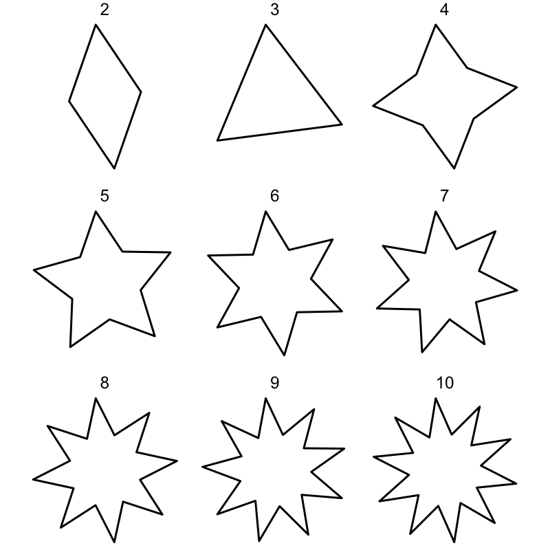

<!-- README.md is generated from README.Rmd. Please edit that file -->

```{r, include = FALSE}
knitr::opts_chunk$set(
  collapse = TRUE,
  comment = "#>",
  fig.path = "man/figures/README-",
  out.width = "100%"
)
```


# ggshapes

<!-- badges: start -->
[](https://travis-ci.org/EmilHvitfeldt/ggshapes)
<!-- badges: end -->

The goal of ggshapes is to add more shapes such and stars and other curves to ggplot2 the same way [ggforce](https://github.com/thomasp85/ggforce) adds regular polygons and circles.

## Installation

You can install the released version of ggshapes from [CRAN](https://CRAN.R-project.org) with:

``` r
# Not released yet
install.packages("ggshapes")
```

And the development version from [GitHub](https://github.com/) with:

``` r
# install.packages("devtools")
devtools::install_github("EmilHvitfeldt/ggshapes")
```

## Examples

ggshapes provides many closed curves, one of which is the simple [rose](https://en.wikipedia.org/wiki/Rose_(mathematics)) curve.

```{r example}
library(ggshapes)
ggplot() +
  geom_rose(aes(n = 2, d = 1, c = 0)) 
```

Each of these geoms comes with some tuning parameters that result in widely different curves so you should play around.

```{r}
data <- data.frame(a = rep(1:6, times = 6),
                   b = rep(1:6, each = 6),
                   delta = 1)

ggplot(data) +
  geom_lissajous(aes(a = a, b = b, delta = delta)) +
  facet_grid(a ~ b) +
  labs(title = "lissajous curves at varying values of a and b", x = "b", y = "a") +
  theme_minimal() +
  theme(axis.ticks.y = element_blank(),
        axis.text.y = element_blank(),
        axis.ticks.x = element_blank(),
        axis.text.x = element_blank())
```

ggshapes doesn't natively work with [gganimate](https://github.com/thomasp85/gganimate) but gifs can be hacked together using [gifski](https://ropensci.org/technotes/2018/07/23/gifski-release/).

```{r, eval=FALSE}
library(gifski)
makeplot <- function(){
  data <- expand.grid(tips = 2:10, time = seq(0, pi * 2, length.out = 50)[-1])
  
  datalist <- split(data, data$time)
  lapply(datalist, function(data){
    p <- ggplot(data) +
           geom_star(aes(n_tips = tips, rotation = time)) +
           coord_fixed() +
           theme_void() +
           xlim(-1, 1) +
           ylim(-1, 1) +
           facet_wrap(~tips)
    print(p)
  })
}

gif_file <- save_gif(makeplot(), width = 800, height = 800, res = 200, delay = 0.01, gif_file = "man/example.gif")
```



## Design choices

All the geoms that produces closed curves (under certain choice of parameters) comes with a couple of geom specifit tuning parameters (`n`, `d` and `c` for `geom_star()`) and some shared aesthetics

- x0
- y0
- xscale
- yscale
- rotation

which denote the x and y coordinate of the center, the x and y scaling of the curve and its rotation in radians. By defaults the geoms produces curves bounded between -1 and 1, centered around (0, 0). Rotation is not applied by default. If rotation and scaling is applied then the curve will not be bounded anymore (as it retains its scale).

```{r}
ggplot() +
  geom_rect(aes(xmin = -1, ymin = -1, xmax = 1, ymax = 1), fill = NA, color = "red", size = 1) +
  geom_lissajous(aes(a = 5, b = 4, delta = 2)) +
  theme_minimal() + 
  coord_fixed() +
  labs(title = "The curve is bounded by the square going from (-1, -1) to (1, 1)")
```

```{r}
ggplot() +
  geom_rect(aes(xmin = -1, ymin = -1, xmax = 1, ymax = 1), fill = NA, color = "red", size = 1) +
  geom_lissajous(aes(a = 5, b = 4, delta = 2, rotation = pi / 7)) +
  theme_minimal() +
  coord_fixed() +
  labs(title = "Rotation will leave the curve at the same size")
```

## Inspiration

The original inspiration for this package came from the post [film flowers](http://bl.ocks.org/sxywu/raw/d612c6c653fb8b4d7ff3d422be164a5d/) by [Shirley Wu](https://twitter.com/sxywu) which drove me to the realization that such visualizations are quite the hassle to do in ggplot2 right now.
